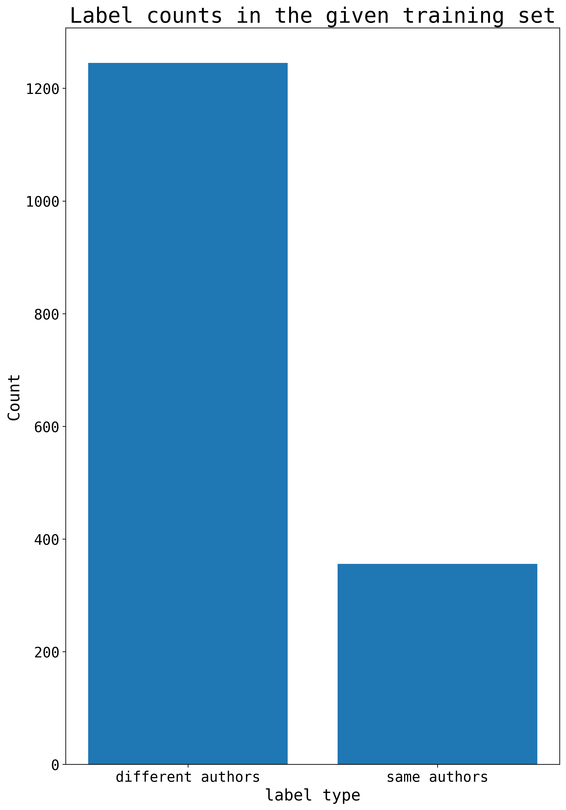
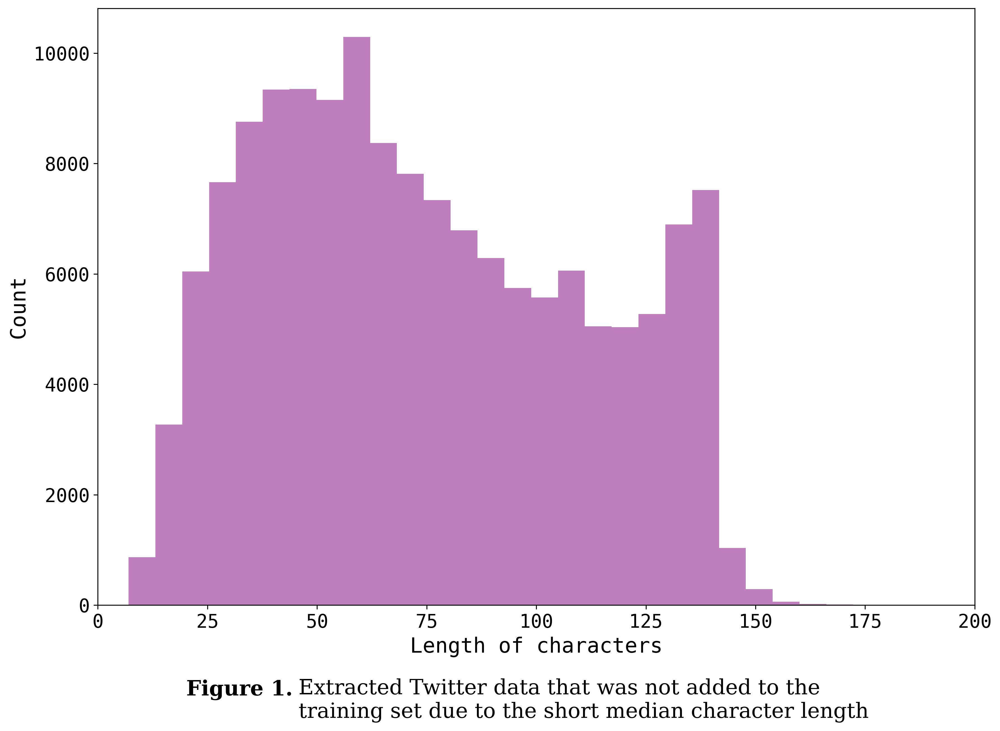
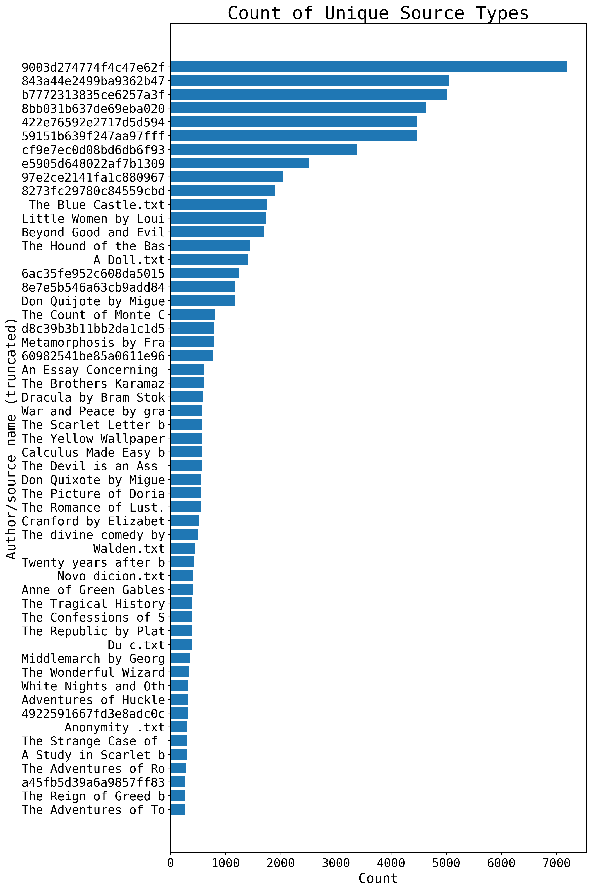
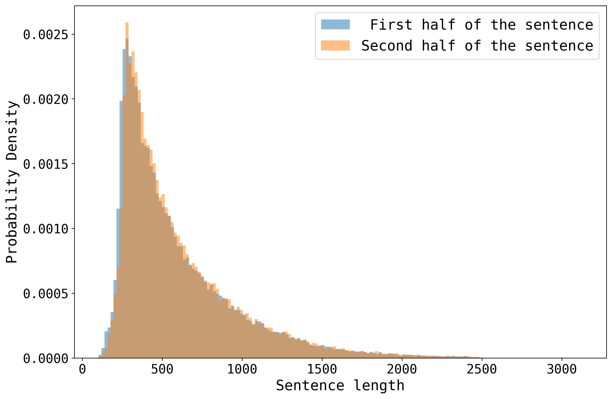
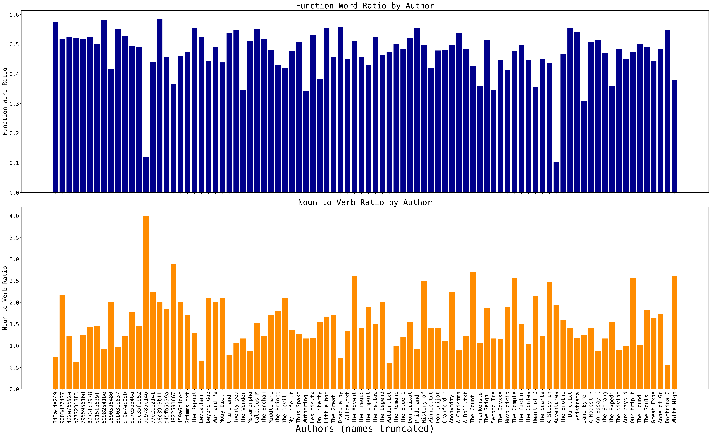
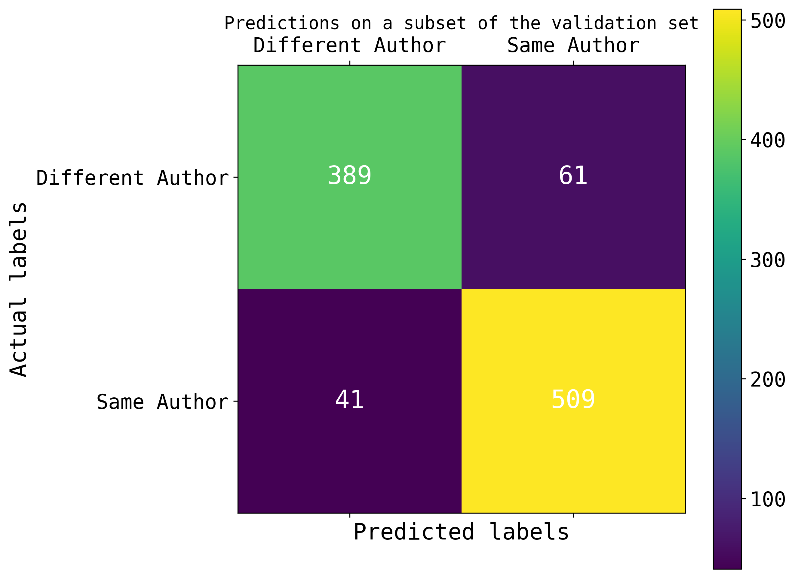

# authormatcher
(I worked on this project as part of a university course on advanced natural language processing.)

## Task summary

This task in this course competition was related to authorship _matching_. A training set
and test set were provided. The training set had the following three columns:
1. **ID**: A unique ID assigned to the row
2. **TEXT**: A sentence pair divided by a separator (`[SNIPPET]`)
3. **LABEL**: A truth value label which could be either 0 or 1

The training set only had the ID and TEXT columns.

The goal was to train a model that would be able to identify whether the first and
second halves of the sentences divided by the separator were written by the same
author or not. If written by the same author, the model would predict 1, otherwise,
the model should assign it the label 0.

## Exploratory data analysis

Initial analysis of the data highlighted two issues:
1. The number of training examples in the given dataset were low. With a mere ~2000
examples, the model wouldn't be able to learn the style of different authors.
2. There was a class imbalance; there were far more mismatched authors than the
counterpart.

To remedy this issue, the majority of time was spent gathering and pre-processing new
data. Twitter, reddit, goodreads, and additional books data were explored. Of these
the latter three were chosen as they seemed to contain an abundant amount of sentences
from a diverse range of authors. The hope was that the abundance of samples and the
diversity of writing styles would make the model generalize to out-of-distribution
examples. Particular care was taken when curating the data. For instance,
sequences that were too short (<300 characters) were removed, while extremely lengthy
sequences (5000-25000 characters) were split into smaller chunks. Post-data compilation,
around 90,000 new training examples were gathered from the three sources. The plot
below shows the source of the new sentences and their authors. The alphanumeric
sequences are Goodreads user IDs while the ones in plain english are book titles.

The data were pre-processed two times. Unnecessary characters such as emojis,
excessive punctuation, HTML links, etc were removed. Non-English sentences were also
removed using the `langdetect` library. Gibberish text was identified and removed as
well. To create the labels, the sentences were halved and randomly mixed and matched.
The length of the halved sequences were roughly equal, as shown below.

Lastly, authorship writing style diversity was also measured using the the `spacy`
library in python. A quick exploration showed that while function diversity across
authors was comparable, there was quite a bit of diversity for noun-to-verb ratio. The
latter might help the model learn and distinguish between sentences which are more
action focused vs. those which are more descriptive.

## Results

#### Attempt I
The first time the data were pre-processed, the random mixing and matching of halved sentences were done without much introspection. That is, the source and author of the sentences that were mixed and matched weren't paid much attention to. Despite this, and likely due to the increased size of training examples, the model was able to achieve an F1 score of 0.5073, an improvement over the random score but just shy of the baseline.

Due to the random mixing and matching, it is possible that the model picked up on
superficial features when differentiating the sentences instead of truly learning
about the authorship styles. For example, if the first half was from goodreads and had
a more colloquial writing style and the second half was from a book and had a more
formal writing style, the model would learn how to distinguish between these two.
However, in cases where both the sentences were from formal sources but different
authors (that is, hard negative examples), the model would struggle and not be able to
perform well.

These considerations guided the second attempt.
#### Attempt II
While the pre-processing of redundant characters were nearly identical in the second attempt, more care was given to the mixing and matching of sentence halves. The source of the text for all the sentences were recorded. Only sentences from similar author types were matched with each other; that is, sentences from goodreads weren't matched with those from books and vice versa, in an attempt to gather as many hard negative examples as possible. Additionally, some matched sentences were flipped to break continuation — the first half became the second half and vice-versa. This was done to disincentivize the model to learn features based on continuity and focus more on the writing style. In both the cases, it was ensured that swaps of the sentence halves were only made if the sequence length of the two halves weren't more than double of each other.

Unfortunately, while the training data was curated much more carefully this time, the
model wasn't able to learn from the examples; this happened most likely due to an
error in the randomization process. The F1-score from this second attempt was around 0.4.

## Error analysis

The error analysis shows for the best model (i.e., from Attempt I) shows that on a
validation dataset with a thousand randomly chosen example, the model achieves an
F1-score of 0.509, which is quite similar to its performance on the test set. The
validation set contained examples from reddit, goodreads, and a few books, so this
shows that the model weakly generalizes to new examples.

## Reproducibility

1. After setting up a python environment, install the necessary package requirements by
running `pip install requirements.txt`
2. Run the notebook `compiling_more_data.ipynb` sequentially to gather and visualize
data from the new sources. The links to all the data repositories have been provided.
    - For the new gutenberg books, run the notebook `Top_Ranked_Gutenberg_Ebooks_Download.ipynb`
3. For pre-processing and randomly mixing and matching the data, run
`prepping_new_data.ipynb` cell-by-cell.
4. To train the model: either use `test_space_582_comp.ipynb` if local computing
resources are sufficient. Otherwise, use `fine_tune_roberta.py` in combination with
`run_finetune.slurm` on a computing cluster.
5. After the model is done training, visualize the data and perform analysis using `eda_and_error.ipynb`

## Future Improvements

> I posit that once the amount of training data is increased, the model should perform
at least better than the randomized baseline.

The hope with this approach was multiplying the amount of fine-tuning data so that the
model would be exposed to a diversity of new examples. For the next time, spending more
time and being more cautious while mixing-and-matching sentences could help this
model "learn" about authorship styles and perform much better than the baseline.

Future attempts could include stylometric modeling of text; these features when passed
to the model could help it better learn how to distinguish between the writing styles
of different authors. Another possibility could be using a contrastive loss function
instead of the standard cross-entropy loss. The contrastive loss would be based on the
embeddings of the text, which would better capture the style of the author's writing;
embeddings of similar text would be clustered together, while those with differing
style would be separated in the model's feature space.
